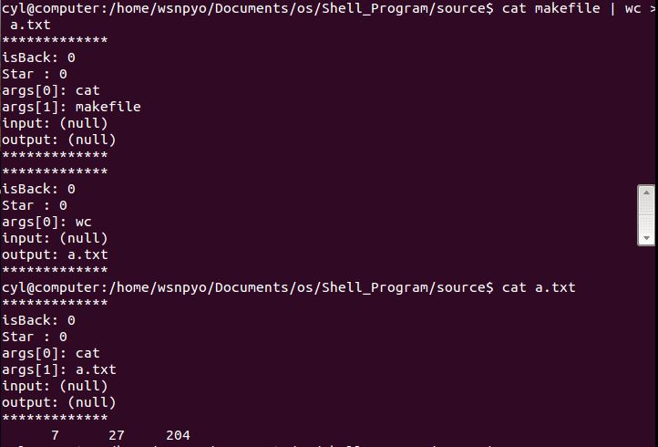

# 
 Shell 程序实验 

### 小组信息 :
组长: 陈逸伦 (13061082)  
组员: 千钊 (13061091) , 徐艾麟 (13061068) , 王思佳 (13061075) , 刘宣佑 (13061069)

## 实验内容

1. **将*flex*和*bison*结合起来使用进行语法和词法分析**
	* flex作为词法分析器， bison作为语法分析器
	* 我是通过对它们俩的搭配使用， 将其中flex作为提取输入命令字符串(*inputBuff*)的工具， 并且将*flex*返回bison所需要的yylex()函数功能， 用于bison的语法分析树， 从而对于命令格式的匹配， 一旦发现错误， 则调用yyerror()显示输入错误.   
	flex具体实现如下:

	

	**flex.l**

	bison具体实现如下:

	

	**bison.y**

  具体可以参看源码

2. **通配符的支持与实现，实现星号“*”和问号“？”通配符即可**

   * 通配符实现是通过shell脚本的调用实现的， 从而实现对正则表达式的解析  
   实现效果如下: 

	

	通配符实现效果

3. **实现对管道的支持**  
	* 管道符左边命令的输出就会作为管道符右边命令的输入。连续使用管道意味着第
一个命令的输出会作为 第二个命令的输入，第二个命令的输出又会作为第三个命
令的输入
	* 实现过程中需要利用的亲属进程之间的管道通信， 也就是通过C函数中pipe进行连接， 按照书上的写法， 如果命令之间含有管道， 每次运行第一条命令时， 需要用dup2将标准输出定向到其输出管道， 并且在另一条指令上， 将标准输入定向到之前这个输入管道（即管道的另一头）
	* 多条管道时需要对首尾的输入输出进行特殊处理一下
	* 其中需要注意的是父进程与子进程之间的处理， 每次在父进程中需要利用waitpid(child_pid)来等待子进程执行完毕后才能够继续进行下去  
	实现效果:

	

	管道实现效果

4. **实现Ctrl+Z, Ctrl+C**  
	* 让user-sh挂起在前台运行的作业，没有任何作业时，则该特殊键无效  
	* 实现过程中需要注册其Ctrl_Z, Ctrl_C信号， 之后在创建与源码中Ctrl_Z类似的处理方式， 不同之处就在于Ctrl_Z是将前程序挂起， 并添加到job当中记录， 而Ctrl_C是将前台程序杀死
	* 对于demo后台程序的执行测试:

	

	demo后台执行效果

	可以看到后台程序执行并不会被Ctrl_Z 和 Ctrl_C杀死， 实现方法即需要添加两后台程序对其的屏蔽函数
> 代码:  
> signal(SIGINT, SIG_IGN);   
> signal(SIGTSTP, SIG_IGN);  backstage omit    

* 对demo前台运行测试:

	

	demo前台执行效果

	可以看到在前台运行的程序会被Ctrl_Z挂起， 并且通过fg将挂起的demo重新继续执行
	
5. 其他补充
	* 对于特殊字符处理，比如demo最后输出的特殊字符，需要特殊判断一下
> c = getchar();  
> if(c!=-1) ungetc(c,stdin);
